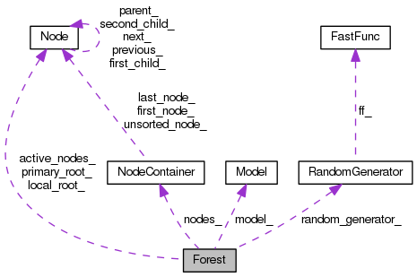

# CodeMonkey_scrm

 - [Import scrm as a submodule](#submodule)
 - [Brief introduction on Automake](#automake)
 - [Testing utility](#unittest)
 - [Continuous intergration](#travis)
 - [Doxygen](#doxygen)
 - [Write a simple program](#scrm)

## Import scrm as a submodule<a name="submodule"></a>
```bash
git clone https://github.com/shajoezhu/CodeMonkey_scrm.git CodeMonkey_scrm
cd CodeMonkey_scrm
```
Update submodule
```bash
git submodule init         # Initialize the local configuration file
git submodule update       # Fetch all the data from scrm
```
```bash
cat .gitmodules            # It shows the included submodule information, as the following.
[submodule "scrm"]
	path = scrm
	url = https://github.com/scrm/scrm.git
```
Newly add a git submodule.
```bash
git submodule init         # Initialize the local configuration file
git submodule add https://github.com/scrm/scrm.git
```

## Brief introduction on Automake<a name="automake"></a>
Compile scrm
```bash
cd scrm
./bootstrap
make -mj4
```

## Testing utility<a name="unittest"></a>
```bash
ls tests/unittests/
make check -mj4
```

You should see
```
PASS: unit_tests
PASS: algorithm_tests
============================================================================
Testsuite summary for scrm 1.3.2.9000
============================================================================
# TOTAL: 2
# PASS:  2
# SKIP:  0
# XFAIL: 0
# FAIL:  0
# XPASS: 0
# ERROR: 0
============================================================================
```

## Continuous intergration<a name="travis"></a>
```
cat .travis.yml
```
For more details, please refer to https://travis-ci.org/scrm/scrm/builds/45372001

## Doxygen<a name="doxygen"></a>
```bash
git checkout -b doc origin/doc        # Switch to branch doc
sudo apt-get install doxygen graphviz # Download programs: doxygen, dot
./bootstrap
make doxygen-run                      # Compile doxygen documentation
google-chrome doc/html/index.html     # Open doxygen documentation with your favourite web browser
```


## Write a simple program<a name="scrm"></a>
```bash
git checkout -b omp origin/omp  # Switch to branch omp
cd ..                           # Switch to CodeMonkey_scrm root diretory
aclocal                         # Generate aclocal.m4 from configure.ac file
autoconf                        # Generate configuration file
automake -a                     # Generate Makefile
./configure
make -mj4

time ./codeMonkey_scrm 30 1000 -r 100 10000 -seed 1 > /dev/null
real	0m6.035s
user	0m6.001s
sys	0m0.012s
time ./codeMonkey_scrm_omp 30 1000 -r 100 10000 -seed 1 > /dev/null
real	0m2.081s
user	0m7.533s
sys	0m0.658s
```
